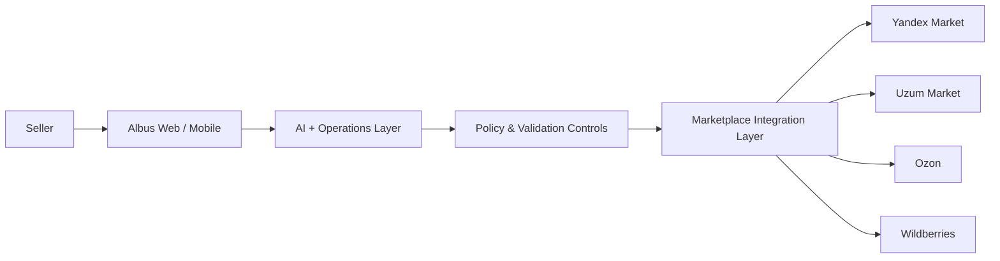

# Albus — AI Multi‑Marketplace Seller OS

**One workspace for marketplace operations, AI assistance and seller control.**

[Website](https://albus.mobi) · **Stage:** MVP · **Market:** Uzbekistan → Central Asia / CIS

> **Public startup showcase.** This repository is intentionally sanitized for evaluation. It demonstrates the product concept, engineering approach and selected non-sensitive reference code. Production source code, marketplace credentials, private API mappings, prompts, customer data and commercial business logic are not included.

---

## The problem

Marketplace sellers lose time and accuracy because products, orders, stock, prices and operational issues are managed in separate seller cabinets with different rules and workflows.

As the number of channels grows, teams face:

- repetitive manual work;
- inconsistent product cards and attributes;
- stock and price mismatches;
- missed operational issues;
- more order cancellations and human error;
- higher cost of managing multiple marketplaces.

## The solution

**Albus** is an AI-powered operating layer for marketplace sellers. It brings daily multi-marketplace workflows into one interface and helps sellers prepare, review and manage marketplace operations with AI assistance.

### Core product areas

| Area | What Albus provides |
|---|---|
| Multi-marketplace workspace | One operational view across connected seller accounts |
| AI product content | Product-card creation, enrichment and modernization assistance |
| Orders, stock and prices | Unified monitoring and operational workflows |
| Diagnostics | Critical issues, marketplace health and products requiring attention |
| AI Assistant | Natural-language access to connected marketplace information |
| Controlled actions | Sensitive changes remain permission- and confirmation-aware |

### Target marketplaces

**Yandex Market · Uzum Market · Ozon · Wildberries**

Future expansion may include **Amazon, eBay and Shopify**.

---

## Why Albus is different

Albus is designed as a **Seller OS**, not only as analytics, a listing generator or a single-marketplace tool.

The product combines three layers:

1. **Unified commerce workspace** — seller operations across marketplaces.
2. **AI assistance** — product content, diagnostics and operational guidance.
3. **Controlled execution** — actions are prepared and governed instead of allowing unrestricted AI writes.

The exact production implementation, provider mappings, prompts and marketplace-specific rules remain proprietary.

---

## High-level architecture

This diagram intentionally describes **system boundaries only**. Production routing, API contracts, prompt strategy, data models, retries, marketplace mappings and business rules are excluded from the public repository.

---

## MVP status

Albus is currently at the **MVP stage**. Core workflows and the unified product direction are implemented, while marketplace integrations and reliability controls are being hardened for pilot and market launch.

### Current focus

- unify marketplace workflows;
- improve AI-assisted product-card quality;
- strengthen diagnostics and seller visibility;
- harden integrations and failure handling;
- expand safe, controlled action capabilities;
- prepare the product for wider commercial rollout.

---

## Business model

Albus follows a **SaaS subscription model**. Commercial plans can vary by:

- number of connected marketplace accounts;
- product volume;
- AI usage;
- automation level;
- business / agency requirements.

The long-term goal is to become the AI-native operating layer for marketplace commerce in Uzbekistan and then expand regionally.

---

## What evaluators can review here

This repository is structured to let judges and technical reviewers verify that Albus has a coherent product and engineering foundation without exposing commercial secrets.

- [`EVALUATION.md`](EVALUATION.md) — quick reviewer guide
- [`docs/product.md`](docs/product.md) — product scope and user value
- [`docs/architecture.md`](docs/architecture.md) — sanitized technical overview
- [`SECURITY.md`](SECURITY.md) — public-repository security boundary
- [`src/`](src/) — non-production reference contracts and examples

## What is intentionally not public

The following remain in Albus private production systems:

- production application source code;
- marketplace tokens and credentials;
- private endpoints and provider-specific API mappings;
- AI system prompts and retrieval strategy;
- proprietary product-card enrichment logic;
- marketplace-specific validation rules;
- commercial scoring, ranking and automation logic;
- customer and seller data;
- database schemas and infrastructure configuration.

---

## Intellectual property

This repository is **not open-source**. It is provided only for startup evaluation and demonstration. No license is granted to copy, commercialize, deploy or create derivative products from its contents. See [`LICENSE`](LICENSE) and [`NOTICE.md`](NOTICE.md).

---

## Vision

> **One seller. Multiple marketplaces. One operating system.**

Albus aims to make multi-marketplace commerce simpler, safer and more scalable for sellers in Uzbekistan and beyond.
