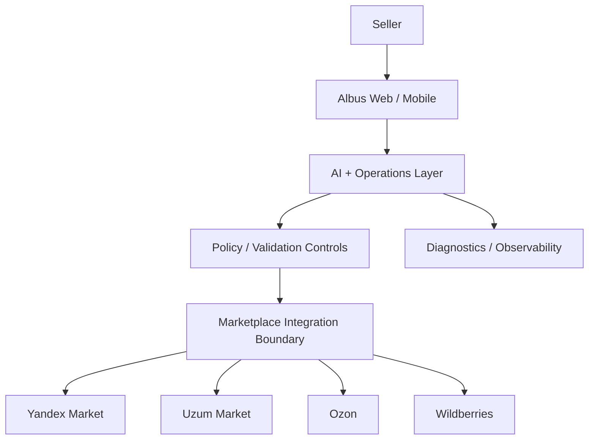

# Albus — Technical Overview

This document describes the **public evaluation-level architecture** of Albus. It intentionally shows system boundaries and engineering principles without exposing production implementation details.

## Design objective

Albus is designed to provide one consistent seller experience across multiple marketplaces while allowing each marketplace to retain its own requirements and capabilities behind a controlled integration boundary.

## System boundaries

## Publicly disclosed components

### 1. Seller experience
A shared desktop/mobile workspace for products, orders, stock, prices, diagnostics and AI-assisted workflows.

### 2. AI + operations layer
AI helps interpret seller requests, prepare content, surface operational issues and assist with safe workflows. The production prompt design, retrieval strategy, model routing and commercial enrichment logic are private.

### 3. Control boundary
Sensitive changes are not treated as unrestricted AI output. Albus applies product-level controls before an eligible operation can be executed. Exact policies, thresholds and internal rules are proprietary.

### 4. Marketplace integration boundary
Marketplace-specific behavior is isolated from the main seller experience so Albus can support multiple channels without duplicating the entire product for every provider. Provider-specific request mappings, endpoints and validation logic are not published.

### 5. Diagnostics and reliability
The production system is designed around operational visibility, error handling and safe recovery. Detailed retry policies, rate-limit logic, provider error maps and infrastructure topology remain private.

## Engineering principles

- server-side credential isolation;
- least-privilege access;
- explicit control of sensitive actions;
- clear marketplace capability boundaries;
- auditability for important operations;
- resilient handling of provider failures;
- no production secrets in browser-delivered code;
- extensibility for additional commerce channels.

## What this repository does **not** disclose

This public showcase intentionally excludes:

- production service topology;
- production database schemas;
- provider-specific API contracts;
- credentials or secret-management implementation;
- AI system prompts;
- marketplace field mappings;
- proprietary category / attribute resolution logic;
- product scoring and enrichment algorithms;
- internal automation thresholds;
- customer data structures;
- production deployment configuration.

## Scaling direction

The architecture is intended to support additional commerce channels without changing the fundamental seller experience. Future expansion may include Amazon, eBay, Shopify and other regional platforms.

> This document demonstrates Albus's engineering direction for startup evaluation. It is not a production implementation guide.
